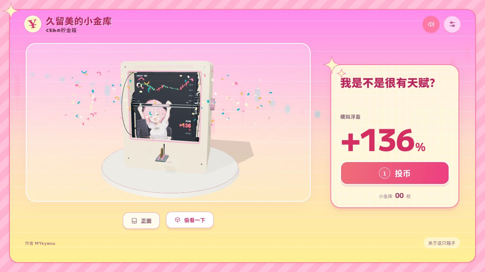

# 久留美的小金库

**再涨一点，就一点。……等一下？！**

[▶ 在线试玩](https://m1kywuu.github.io/kurumi-flip-bank/)



投一枚硬币，给久留美八到十二秒。

刚刚还是交易天才，下一秒已经开始解释「只是回调」。翻页越来越快，盈亏蹦来蹦去，最后啪地停住。

这是一个能转、能拆、能存硬币的 3D 翻页小玩具。久留美负责回本大作战，小箱子负责存硬币。

## 先投一枚再说

- **投币入场**：点按钮、点槽前的硬币，或者按空格。也能亲手把硬币推进槽口。
- **拿起来看看**：拖动绕着箱子转，滚轮缩放。点「偷看一下」，看看小金库里到底有什么。
- **不服，再拨一页**：点侧面的旋钮，或在场景中按 Enter。「正面」帮你转回来看久留美。

设置里有奶油、木质、薄荷三款箱体。还可以装上 **8–24 张自己的图片**，给小箱子换一出戏；慢慢翻、清空币仓也在那里。

## 回本？回本！

24 张行情，8 种表情。赚钱和亏钱各 12 张，最终停页的概率是 **赚 1/3、亏 2/3**。

红涨绿跌，前后 K 线接着走。暴涨时得意，跳水时嘴硬。

小赚鼓掌，大赚欢呼，两侧彩带安排上。亏了？安静一会儿。右上角可以关声音。

仓里最多装 32 枚。最终停在 **−100% 或更低**，强制平仓，金币一起归零。开盖看看……真的一枚都没了。

模拟行情，认真破防。

## 把小金库搬回家

下载源码后，在项目目录运行：

```sh
npm ci
npm run dev
```

打开终端里显示的本地网址，就能开玩。

改好后用 `npm run build` 打包。提交到 `main`，GitHub Pages 会自动更新试玩网页。

想换角色、画页或箱体，翻翻 [扩展接口](docs/扩展接口.md)。发布设置见 [GitHub Pages 发布](docs/GitHubPages发布.md)。

## 小箱子的来历

灵感来自 [奈櫻Nine的投币式感应动画存钱箱](https://www.bilibili.com/video/BV1pEa66NEct/)。角色来自《FX战士久留美》，粉色斜纹、奶油网格和一点点强平气息参考 [动画官网](https://fxkurumi-info.com/)。

**M1kywuu 制作 · 久留美同人小玩具**

[素材与依赖](THIRD_PARTY_NOTICES.md) · [机构与行情记录](docs/验证记录.md)
