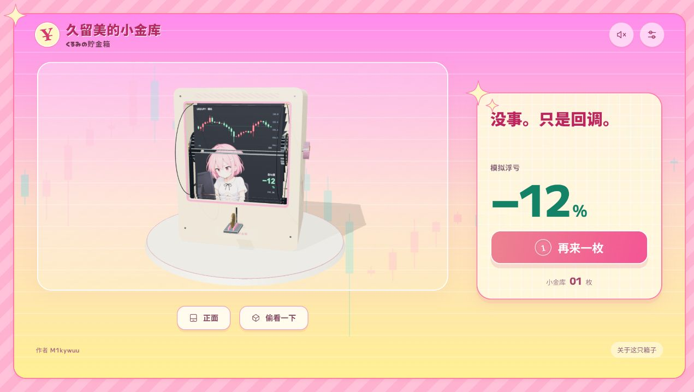

# 久留美的小金库

作者 **M1kywuu** · 非官方二创网页玩具

[在线试玩](https://m1kywuu.github.io/kurumi-flip-bank/) · [GitHub 项目](https://github.com/M1kywuu/kurumi-flip-bank)



在原有网页上优化的 3D 翻页存钱箱：投一枚硬币，行情快翻，久留美从得意到崩溃，最后随机停在一页。箱子可以自由观察、开盖、手动拨页，以及更换箱体与画页。

## 打开网页

成品在 `dist/`，不需要 Sites、账号或后台服务。在本目录运行：

```sh
python3 start.py
```

浏览器会自动打开。Linux 也可以运行 `运行网页.sh`。请通过这个本地网页服务打开，不能直接双击 `dist/index.html`。关闭启动窗口或按 Ctrl+C 停止。

## 玩法

- 拖动旋转观察，滚轮或双指缩放；箱子始终直立。
- 点“投币”、槽前硬币，或按空格。也可以把硬币沿托盘推进槽口。
- 硬币经过感应器才启动；当前一轮结束后才能继续投币。
- 点侧面旋钮或在场景中按 Enter 拨一页；“正面”恢复视角，“偷看一下”打开箱体。
- 设置中可换外观、装入 8–24 张图片、慢翻或清空硬币。图片按文件名自然排序，只在本地处理；刷新后不保存。
- 硬币仓容量 32 枚。行情如何变化，存下的硬币仍在箱子里。

默认有 24 张行情画页与 8 幅新绘制的角色表情。每轮快翻约 8–12 秒，再减速停页。红涨绿跌的 K 线为连续模拟行情：每页推进 5 根新蜡烛，保留前面的 26 根，24 页首尾相接、共用固定刻度。盈利和亏损各 12 页，最多连续两页同方向。最终停页按权重随机：盈利页权重1、亏损页权重2，因此停在盈利页的概率为1/3、亏损页为2/3；每轮独立，不保证每三轮恰好一赚两亏。价格和盈亏均为虚拟剧情，不是实时行情或真实账户收益。

默认存钱箱为奶油色圆角外壳，配淡粉色窗框、旋钮和侧面星芒斜纹；设置中仍可切换木质或薄荷外观。三款背面均为冲高跳水、硬币与星芒图案，没有文字铭牌；页脚标注作者 M1kywuu。

新视觉参考动画官网的粉色斜纹、渐变、奶油黄网格与圆角牌子；大亏损时有短暂的强制平仓反应，可以开盖看看硬币。详见 [官网风格对照](docs/官网风格对照.md)。

## GitHub Pages

项目已提供自动发布配置。仓库使用公开的 `M1kywuu/kurumi-flip-bank`；在 **Settings → Pages** 中选择 **GitHub Actions** 作为发布来源，向 `main` 提交后自动更新试玩网页。

配置与后续操作见 [GitHub Pages 发布](docs/GitHubPages发布.md)。

## 发布到自己的服务

上传 **dist 文件夹内的全部内容** 到任意静态网站服务。文件使用相对路径，支持网站子目录。角色图、渲染库和物理库随包提供，运行时没有外部行情请求。

## 继续修改

```sh
npm ci
npm run dev
npm run build
npm run check
npm run check:shell
```

技术栈：Three.js 0.186.1、Rapier 0.21.0、Vite 8.3.2。页片使用铰链与凸轮约束运动，硬币使用刚体重力和碰撞。独立接口支持主题、8–24 页实体页片数和箱体外观；改变内部尺寸仍需重新检查机械与碰撞。

- [调研与设计](docs/调研与设计.md)
- [扩展接口](docs/扩展接口.md)
- [验证记录](docs/验证记录.md)
- [角色插画记录](docs/illustration-prompt-v2.md)
- [素材与依赖](THIRD_PARTY_NOTICES.md)

当前角色素材：`public/assets/kurumi-expressions-v2.png`。旧插画保存在 `docs/archive/`，不会加载到成品网页。
