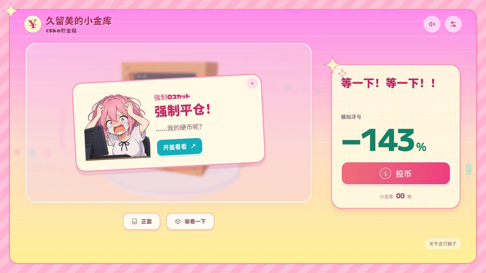
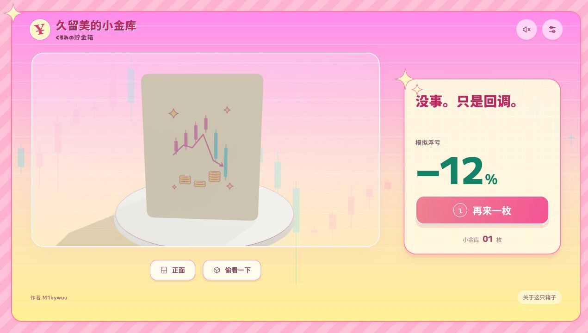
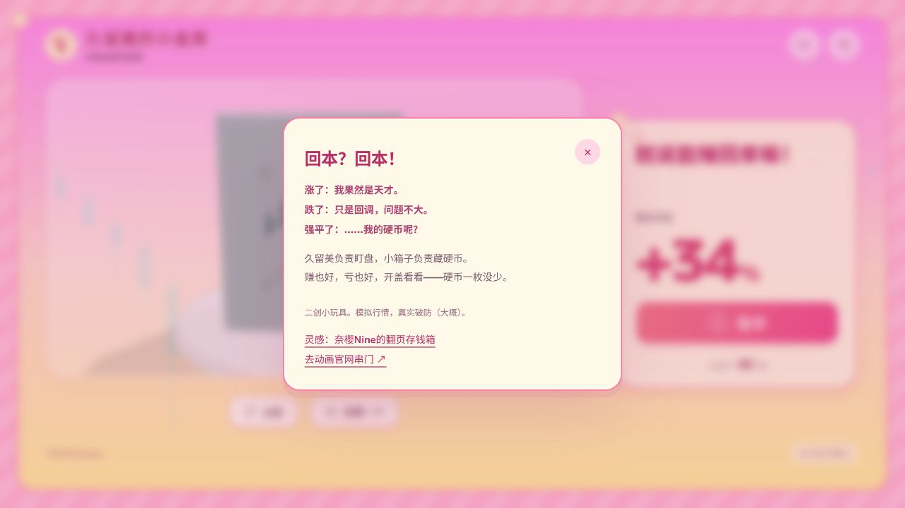

# 官网风格对照与本轮修改

2026-10-03。在原有3D存钱箱上增加展示层，机构、硬币碰撞、24页连续模拟行情、8–12秒快翻和换主题接口继续保留。

## 直接查看的画面

主代理亲自读取了官网的 [主视觉原图](https://fxkurumi-info.com/assets/img/top/visual/visual1.jpg)、[奶油黄网格底](https://fxkurumi-info.com/assets/img/top/hero_logoarea_bg.jpg)、[粉色斜纹](https://fxkurumi-info.com/assets/img/common/frame_grad.png)、[青粉蜡烛图背景](https://fxkurumi-info.com/assets/img/top/bg_rousoku.png)，并在浏览器中查看原HTML/CSS与这些图片的静态组合。

官网在线页在浏览器里反复卡住加载，因此静态参考移除了加载层与外部脚本；它用于观察颜色、排版、圆角和装饰位置，不能据此声称亲自玩过官网的完整动态演出。动态行为另以官网JS核对。原官网图片和源码仅存临时参考目录，没有打包到成品中。

## 采用的设计关系

- 粉色斜纹外框，内侧粉紫到桃杏、淡黄的渐变；淡色行情柱与横向网格构成背景。
- 奶油黄网格牌子、粉色细边与圆角，青色作小动作点缀；自行绘制描边星芒。
- 数值使用M PLUS 1，日文短标题使用Cherry Bomb One；中文沿用完整的系统中文字体，避免字形混杂。
- 角色短句和盈亏居于同一块牌子，投币保持唯一主动作。资料、换图与慢翻仍在次级窗口。
- 主行情仍保留用户指定的红涨绿跌；官网的青粉组合用于背景装饰与品牌点缀。

依据：[官网公共CSS](https://fxkurumi-info.com/assets/css/common.fxkurumi.css)、[首页CSS](https://fxkurumi-info.com/assets/css/top.fxkurumi.css)。视觉层在 `src/official-style.css`，背景与反应在 `src/presentation.js`，便于后续主题替换。

## 场景与按钮

观察按钮独立于场景窗口：桌面28px、窄屏24px间隔。镜头目标略下移，使箱子与底座在画框内保留底部空隙。手机上为长负数和“再来一枚”留独立空间，收起按钮内多余的硬币标记，并给台词保留稳定高度。

## 借来的梗与审查

[官网首页JS](https://fxkurumi-info.com/assets/js/top.fxkurumi.js)会在接近页尾时触发强制平仓演出，带黑幕、滚动锁定和回到顶部。小金库是短页玩具，直接复制这个触发会导致初开页面就平仓或打断观察，因此没有照搬。

当前把大亏损停页作为触发点：显示久留美的反应牌，最多2.6秒，能立即关闭；新投币也会收起。点击“开盖看看”直接打开箱体，让“亏了，但硬币还在”的反差落到实际互动上。手动拨到该页也会有角色反应，Enter提供与侧面旋钮同等的键盘入口。

拒绝堆公告、角色档案、假文件管理器、全屏黑幕与长时间锁滚动；它们不适合这个可把玩的单一对象。

## 本轮验证

浏览器确认手动拨页、反应牌显示/关闭、反应中的开盖、真实投币、薄荷/木质箱体切换正常，控制台无错误。375px与320px宽度没有横向溢出；375px下场景/观察按钮间距24px，长负数与投币按钮之间12px，主按钮高59px。

## 存钱箱与背景统一

默认箱体由木纹改为奶油色圆角外壳，粉色窗沿与旋钮呼应投币按钮；侧面的淡斜纹、星芒和¥与外框及页头相呼应。外轮廓使用14mm圆角和连续弧面，前窗、侧轴孔及投币槽保留真实开孔。镜头稍偏正面，兼顾画页阅读和箱体厚度。

旧的木质和薄荷外观保留在设置中；主题、画页和行情机制继续独立。

## 后续细节

三款箱背统一去掉文字铭牌，画上“行情冲高跳水，硬币仍在”的无字图案，各自沿用箱体的配色。介绍改为“回本？回本！”及短短的涨、跌、强平反应；作者 M1kywuu 标在页脚。

