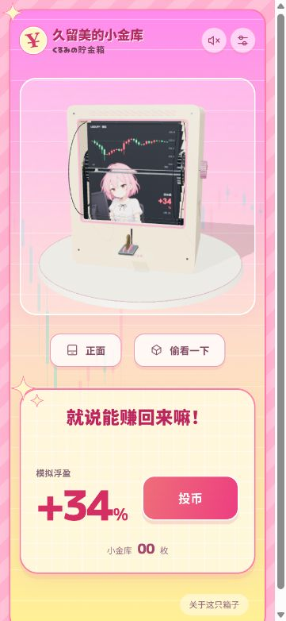
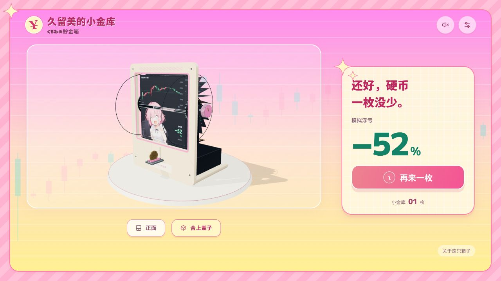

# 验证记录

2026-10-03，当前改版的源码检查与实际浏览器试玩。原始数值输出在 [verification.json](verification.json)，行情回合 DOM 采样在 [browser-market-check.json](browser-market-check.json)。

## 通过的检查

| 检查 | 结果 |
|---|---|
| 构建独立静态网页 | `npm run build` 通过；使用相对资源路径 |
| 默认24页机构 | 10,001个相位，每相位276对叶片；卡中线最小距0.6844mm，扣除卡厚净距0.5044mm |
| 支持的实体页数 | 8至24共17种，每种1,001个相位；没有抽样发现叶片互穿或进入硬币包络 |
| 停页 | 所有支持数量共4,760种起点/目标组合；包含同页与跨循环；上下页映射一致 |
| 连续运动 | 前叶释放及背部收纳接缝速度连续；起止归零，最高10页/秒，全部停位转动时长8.06–12.38秒 |
| 硬币 | 实际Rapier求解器连续32枚穿过感应器、进入仓内，未穿底或逃出；1/120秒步长、CCD |
| OHLC | 120根模拟蜡烛，24页每页31根；全部开盘接前根收盘，含首尾；相邻共有26根逐值相同，纵轴一致 |
| 成品浏览器 | 本地标准静态服务打开，角色图、3D和物理库正常加载；最终试玩无控制台错误/警告 |
| 快速行情反馈 | 最终回合实际8.84秒，盈亏29次跨零，出现涨了/等一下两种反馈；另一个回合约10.19秒；详见browser-market-check.json |
| 画页接口 | 上轮实际选择12张编号图，上下均为01、方向正确；薄荷箱体和恢复默认主题成功；本轮保留接口 |
| 观察和开盖 | 方向键绕转到侧面检查页片、侧盘、导轨和币仓；开盖有“硬币一枚没少”的反应；合盖和正面按钮正常 |
| 窄屏 | 375×812下页面宽375，无横向溢出；投币按钮60px高，观察按钮40px高，核心操作在首屏内 |

## 本轮发现并修正

- 24页扩大铰点圈后，旧前窗下框与固定横杆可能干涉低位导轨；前窗下沿调整为77.5mm并移除干涉横杆。
- 恢复主题时数字缓存可能让自定义页码留在行情面板；主题切换重置显示缓存，实际复查恢复正确。
- 涨跌交替加密后，共用冷却可能压掉某一方向的反馈；改为各方向独立限制重复，最终强平始终给反馈。
- 减少动态效果偏好下，冲击字曾可能持续可见；加入定时清理，同时关闭镜头震动。

## 官网风格改版复查

- 直接查看官网原始图片与原HTML/CSS静态组合，按画面关系确定外框、渐变、网格和圆角；没有把文字总结当作视觉验收。
- 桌面场景到观察按钮28px；375/320px窄屏24px。镜头在画框中保留底部空间。
- 深度亏损的反应牌正常显示，点击开盖后反应收起、侧盖打开；ESC也能关闭。Enter逐页拨动与投币正常，投币后仓内计数为01。
- 木质/薄荷外壳切换、设置窗口正常；新增字体本地加载，控制台无错误/警告。
- 375px宽度下−143%与投币按钮之间12px，按钮高59px；320px也没有水平溢出。手机收起按钮内的冗余币标记，台词预留高度。

## 奶油圆角箱体复查

- 默认外壳改为奶油色圆角轮廓，粉色窗沿与旋钮，侧面使用淡斜纹、星芒和货币符号；原木质与薄荷外壳继续保留。
- 对实际生成的前面板和窗沿三角网格进行射线检查：11,148个页片过框采样全部穿过真实开口；投币槽真实开孔，24mm硬币侧向通过空间保留。
- 新旧外壳的23个币道碰撞体逐项一致；原有机构检查、连续行情检查及32枚Rapier硬币测试再次通过。
- 浏览器实际旋转、开盖、木质/奶油切换和投币正常；一枚硬币通过感应器并完成快翻，仓内计数01，控制台无错误或警告。
- 375×812窄屏没有横向溢出；三个外壳选择按钮均无文字溢出。临时尺寸检查结束后恢复浏览器尺寸。
- `npm run build`及`npm run check:shell`通过。外轮廓圆角位于页片扫掠和币仓以外，内腔接触面继续使用原有碰撞体。

## 停页概率、背面与文案复查

- 按用户选择保留12张盈利、12张亏损的画页。旧停页为每页等概率，新停页为盈利权重1、亏损权重2，即最终盈利1/3、亏损2/3；快翻过程的行情次序和K线没有改动。
- 用3,600个均匀分布的抽签区间采样核查：1,200个停在盈利页、2,400个停在亏损页，每张盈利页100个、每张亏损页200个。无权重的自定义主题仍逐页等概率；随机回合相互独立，不强行轮流安排输赢。
- 奶油、木质、薄荷三款背面铭牌均替换为无字图案，按箱体分别使用粉青、木色和深浅绿配色；实际浏览器转到背面并逐款切换检查。
- 介绍窗口改成“回本？回本！”和角色式短句，保留二创/模拟说明及灵感链接；页脚加入“作者 M1kywuu”。
- 最终构建后的独立浏览器回合通过感应器、快翻并停在第23页（−12%），仓内计数01，按钮恢复可投币，控制台无错误/警告。单轮只验证流程；概率结论来自权重和区间检查。

## 验证边界

页片采用解析铰链/凸轮约束，不是柔性纸张模拟。卡间距主要为二维扫掠筛查及有限厚度扣除，补以实际侧面、正面、开盖与前框/侧盘宽度检查；不是对每个装配件的精确三维碰撞证明，也不是实体制造认证。32枚连续币道验证是求解器测试，浏览器手动试玩未逐枚再投满32枚。

手机检查是浏览器窄屏布局，不是实际手机触控或GPU性能测试。声音开关与合成实现保留，未进行外部声学测量。预览服务中途退出后已重新启动，恢复后完成最终回合与窄屏检查。

当前为闭环模拟行情；12个盈利页和12个亏损页、最多两页连续同号，8种表情全部使用。单根实体变化最大约0.228%、平均约0.046%；这些是当前种子生成结果，不是市场统计估计。虚拟放大盈亏没有模拟真实账户约束。

## 画面

